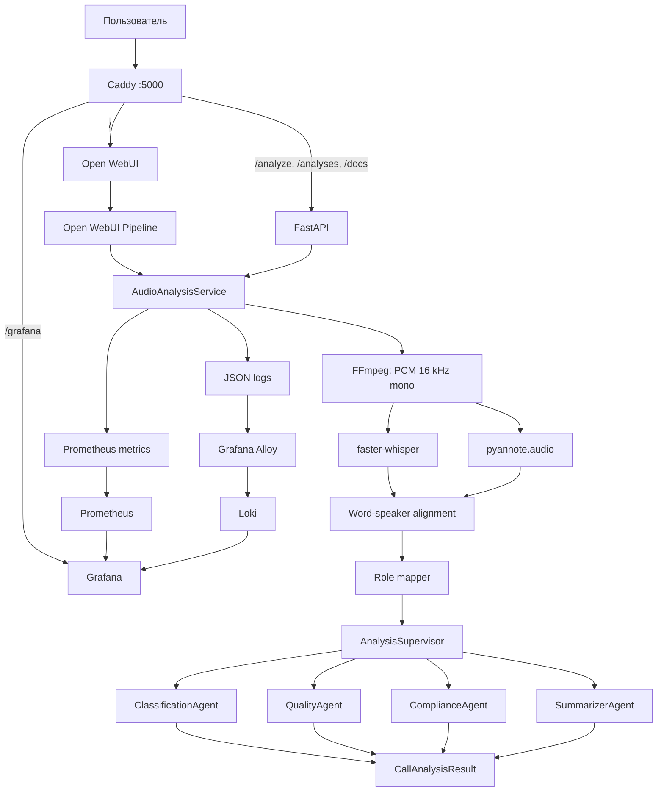

# AI-анализатор банковских звонков

Прототип речевой аналитики контакт-центра: принимает аудиозапись, распознаёт
речь, разделяет реплики оператора и клиента и запускает четыре независимых
LLM-агента для классификации, оценки качества, compliance-проверки и
суммаризации.

Живое HTTPS-демо: [jay.tailf580a.ts.net](https://jay.tailf580a.ts.net/)

## Возможности

- загрузка WAV, MP3 и OGG через Open WebUI или REST API;
- нормализация в PCM WAV 16 kHz mono через FFmpeg;
- ASR на `faster-whisper medium` с word timestamps;
- диаризация `pyannote/speaker-diarization-community-1`;
- назначение ролей «Оператор» и «Клиент»;
- четыре параллельных LLM-агента;
- частичный результат, если один из агентов завершился с ошибкой;
- асинхронный REST API с job ID;
- единая точка входа Caddy;
- метрики Prometheus, JSON-логи в Loki и готовый Grafana-дашборд.

## Быстрый запуск

Требования: Docker с Compose v2, FFmpeg внутри образа, Hugging Face token с
доступом к модели pyannote и ключ OpenAI-совместимого LLM-провайдера.

```bash
git clone <repository-url>
cd call-analytics-case-study
cp .env.example .env
```

Заполните как минимум:

```env
HF_TOKEN=hf_...
LLM_API_KEY=...
LLM_BASE_URL=https://openrouter.ai/api/v1
LLM_MODEL=openai/gpt-oss-20b
PIPELINES_API_KEY=...
OPENWEBUI_API_KEY=...
PUBLIC_BASE_URL=http://localhost:5000
```


Первый запуск занимает больше времени из-за загрузки моделей Whisper и
pyannote. Состояние сервисов можно проверить командой:

```bash
docker compose ps
```

## Публичные маршруты

Caddy слушает порт `5000` и разводит запросы по путям:

| Назначение | Локальный URL | HTTPS-демо |
|---|---|---|
| Open WebUI | `http://localhost:5000/` | `https://jay.tailf580a.ts.net/` |
| Grafana | `http://localhost:5000/grafana/` | `https://jay.tailf580a.ts.net/grafana/` |
| Swagger UI | `http://localhost:5000/docs` | `https://jay.tailf580a.ts.net/docs` |
| OpenAPI | `http://localhost:5000/openapi.json` | `https://jay.tailf580a.ts.net/openapi.json` |
| Создать анализ | `POST http://localhost:5000/analyze` | `POST https://jay.tailf580a.ts.net/analyze` |
| Статус и результат | `GET http://localhost:5000/analyses/{job_id}` | `GET https://jay.tailf580a.ts.net/analyses/{job_id}` |

Прямые порты сервисов оставлены для локальной диагностики: Open WebUI
`3001`, Grafana `3002`, Analysis API `8000`, Pipelines `9099` и Prometheus
`9090`.

## REST API

### Отправка файла

```bash
curl -i \
  -X POST https://jay.tailf580a.ts.net/analyze \
  -F 'file=@test_data/02_lost_card_8k.wav'
```

Также поддерживается URL источника:

```bash
curl -i \
  -X POST https://jay.tailf580a.ts.net/analyze \
  -H 'Content-Type: application/json' \
  -d '{"url":"https://example.org/call.wav"}'
```

API валидирует и сохраняет входной файл, создаёт фоновое задание и отвечает
`202 Accepted` с заголовком `Location`:

```json
{
  "job_id": "e6f8d1b2-...",
  "status": "queued",
  "status_url": "https://jay.tailf580a.ts.net/analyses/e6f8d1b2-..."
}
```

### Получение результата

```bash
curl https://jay.tailf580a.ts.net/analyses/e6f8d1b2-...
```

Статусы задания: `queued`, `processing`, `completed`, `failed`. При успешном
завершении поле `result` содержит итог анализа; отдельного result endpoint нет.
Задания хранятся в памяти процесса в течение
`ANALYSIS_JOB_RETENTION_SECONDS` секунд.

Пример результата:

```json
{
  "job_id": "e6f8d1b2-...",
  "status": "completed",
  "result": {
    "transcript": [
      {
        "speaker": "Оператор",
        "start": 0.0,
        "end": 4.2,
        "text": "Добрый день, банк, меня зовут Анна."
      }
    ],
    "classification": {"topic": "кредиты", "priority": "low"},
    "quality_score": {
      "total": 75,
      "checklist": {
        "greeting": true,
        "need_detection": true,
        "solution_provided": true,
        "farewell": false
      }
    },
    "compliance": {"passed": true, "issues": []},
    "summary": "Клиент обратился для уточнения условий кредитования.",
    "action_items": [],
    "agent_errors": {}
  },
  "error": null
}
```

Если отдельный LLM-агент получает timeout или невалидный ответ, остальные
агенты не отменяются. Их результаты возвращаются, недоступная секция равна
`null`, а `agent_errors` содержит имя и тип ошибки упавшего агента.

## Архитектура



Open WebUI и FastAPI являются двумя входами в один `AudioAnalysisService`,
поэтому нормализация, ASR, диаризация и агентный анализ не дублируются.

### Ключевые решения

**Нормализация аудио.** Любой поддерживаемый контейнер заранее преобразуется в
PCM WAV. Это устраняет различия start time, padding и seek между WAV, MP3 и
OGG и стабилизирует ASR/диаризацию.

**ASR.** `faster-whisper medium` выбран за CTranslate2, CPU INT8, word
timestamps и меньшее потребление памяти по сравнению с оригинальным Whisper.

**Диаризация.** Pyannote определяет интервалы двух спикеров, после чего слова
Whisper назначаются интервалу с максимальным временным пересечением. В
прототипе первый спикер считается оператором; для production нужны отдельные
телефонные каналы, telephony metadata или role classifier.

**Оркестрация.** Используется собственный Supervisor: workflow фиксированный,
агенты независимы, условных переходов и циклов нет. Все четыре агента запускаются
конкурентно через `asyncio.gather(..., return_exceptions=True)`. LangGraph стал
бы полезен при human-in-the-loop, динамической маршрутизации или циклах ревью.

**LLM.** По умолчанию используется `openai/gpt-oss-20b` через OpenRouter как
компромисс между скоростью, стоимостью и достаточной сложностью для русского
банковского диалога. Клиент пробует structured output в цепочке
`json_schema -> json_object -> plain JSON`, после чего всегда выполняет
локальную Pydantic-валидацию. Concurrency, timeout, retry и максимальное число
completion tokens задаются через `.env`.

## Обсервабилити

Стек наблюдаемости поднимается тем же `docker compose up`:

- приложение пишет однострочные JSON-события в stdout;
- Grafana Alloy читает Docker logs и отправляет их в Loki;
- Prometheus собирает прикладные метрики;
- Grafana автоматически получает datasources и dashboard из
  `observability/grafana/`.

Все события одного запроса связаны `request_id`. Для длительных операций
используется единый контекст `operation(...)`, который пишет:

- `operation.started`, `operation.completed`, `operation.failed`;
- `duration_ms`, `operation`, `service`, `request_id`;
- безопасный stack trace без prompt, ответа модели и текста разговора;
- `llm.usage` с prompt/completion/total tokens и finish reason;
- `agent.failed` для частично завершившегося анализа;
- `transcript.created` и `diarization.created` только с агрегатами.

В Prometheus экспортируются:

- `call_analytics_calls_total{topic=...}`;
- `call_analytics_quality_score` histogram.

Готовый Grafana dashboard показывает количество обработанных звонков, темы,
распределение quality score, application logs и ошибки операций; события в
логах содержат длительности этапов. Текст
транскрипта, prompt/response и секреты в технические логи намеренно не пишутся.
Уровни регулируются `LOG_LEVEL` и `RUNTIME_LOG_LEVEL`.

## Тесты

```bash
uv sync
uv run pytest -q
```

Интеграционные тесты с реальным LLM вынесены под marker `integration` и по
умолчанию не запускаются:

```bash
uv run pytest -m integration
```

## Тестовые данные и WER

В `test_data/` находятся пять банковских диалогов разных форматов и частот,
включая телефонную запись 8 kHz. Эталонные тексты, гипотезы и отчёты лежат в
`test_case/`.

Повторный расчёт:

```bash
uv run python -m scripts.evaluate_wer
```

| Запись | Слов | S | D | I | WER | CER |
|---|---:|---:|---:|---:|---:|---:|
| `01_credit_16k.wav` | 166 | 8 | 2 | 0 | 6.02% | 5.72% |
| `02_lost_card_8k.wav` | 154 | 3 | 0 | 0 | 1.95% | 0.47% |
| `03_transfer_24k.mp3` | 155 | 4 | 4 | 0 | 5.16% | 4.86% |
| `04_complaint_48k.ogg` | 148 | 8 | 3 | 0 | 7.43% | 8.43% |
| `05_fraud_22k.wav` | 193 | 3 | 2 | 0 | 2.59% | 1.78% |

Полные машинно-читаемые результаты: `test_case/reports/wer.csv` и
`test_case/reports/wer.md`.

## Ограничения и production roadmap

- задания REST API сейчас хранятся в памяти одного процесса;
- обработка CPU-bound и ограничивается semaphore;
- эвристика ролей не покрывает IVR и записи, начавшиеся с клиента;
- для production нужны PostgreSQL, object storage, очередь и GPU workers;
- нужны PII redaction, OAuth2/JWT, tenant isolation, audit log и retention;
- URL-загрузчику требуется более строгая SSRF-защита;
- real-time режим потребует chunked/WebSocket ASR и online diarization;
- Trends Agent должен агрегировать несколько звонков через Python/SQL, оставляя
  LLM кластеризацию и формулирование рекомендаций.

В бонусах можно отметить реализованный
Grafana-дашборд. 
